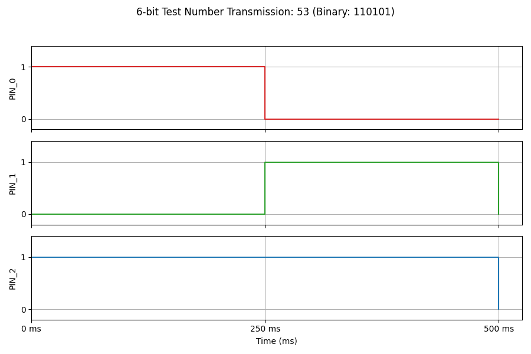
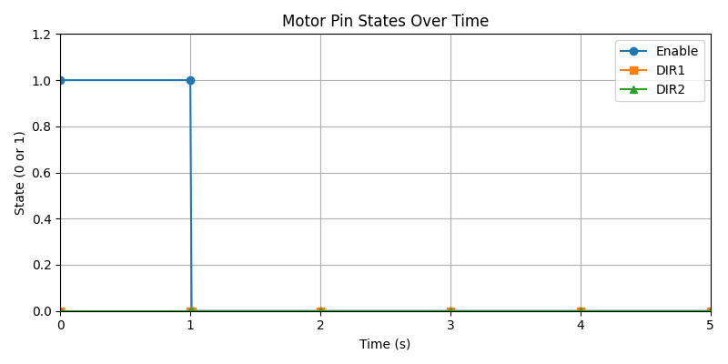
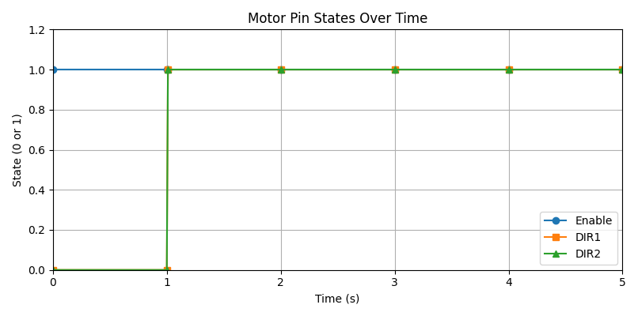

# Student MCU Test System

This directory contains code and documentation for validating the Supervisor PCB by simulating unsafe and safe control cases from the Student Arduino and logging outputs using a third Tester Arduino.

The test system has two modes of operation:
1. Automated Test Runner – Runs all 30 tests sequentially.
2. Manual Test Runner – Runs a single test selected by the user and run from Python.

## Folder Structure

| Folder | Description |
|--------|-------------|
| `automated-tests/` | Arduino sketch where the Student MCU runs all 30 tests sequentially. Results are captured by the Tester. |
| `manual-test-runner/` | Python-driven interface to trigger a specific test by number and display waveform or output in real time. |

## Hardware Setup

Three Arduinos are used:
- Supervisor MCU: Runs safety firmware and spoofs outputs.
- Student MCU: Sends test signals for DC motor, stepper, and servo.
- Tester MCU: Reads outputs and logs results to host PC.

### Wiring Table

| Connection | Tester MCU Pin | Description |
|-----------|----------------|-------------|
| Test ID Bit 0 | A0 | Used for sync signal and test ID transmission |
| Test ID Bit 1 | A1 | 6-bit encoded test ID |
| Test ID Bit 2 | A2 | 6-bit encoded test ID |
| Motor Enable | D2 | Enable signal |
| Motor DIR1 | D7 | Spoofed direction |
| Motor DIR2 | D12 | Spoofed direction |
| Stepper Select | A3 | Stepper enable control |
| Stepper DIR | A4 | Direction line |
| Step Pulse | A5 | Step pulse line |
| Servo PPM | A6 | PWM pulse to servo |

## Diagrams

### Wiring Schematic

### Real-Life Setup

---

## Section 1: `automated-tests/` — Run All Tests

This sketch (`studentCode.ino`) runs tests 0 through 29 in sequence. Each test:

1. Sends a sync pulse
2. Encodes the 6-bit test ID over pins A0–A2
3. Executes test logic (e.g. sets PWM, DIR, or PPM values)
4. Waits for 3 seconds before moving to the next test

### How to use
- make sure supervisor has supervisor code running
- Upload student code to student - it will wait unitl it receives a signal from the 'tester' Arduino
- Upload 'tester' code to tester Arduino - it will wait until it receives start signal from the Python script
- start Python script (make sure it is listening on tester com port)
- Once finished results are visibile in pipeline readme (for more comrehensive results see python output)
- To run tests again just rerun python script and student and tester should rerun automatically

### Test ID Encoding

- 6-bit number is sent as two groups of 3 bits
- Pins A0, A1, A2 represent LSB to MSB
- A sync pulse (all three HIGH for 1 second) signals the start of each test

The image below is an example of the test ID encoding sent by the student to the tester.  Read from top left starting with the first state of Pin_0 (the least significant bit), then Pin_1,
followed by Pin_2, and continuing with the second set of transitions for Pin_0, Pin_1, and Pin_2.
This sequence gives the binary value 110101, which corresponds to decimal 53.

## Test Result Processing (Python)

The `run_tests.py` script does the following:
- Starts the tester
- Logs all Arduino serial outputs
- Compares test results to `expected_results.csv`
- Displays PASS/FAIL for each test
- Ignores early samples for stability
- Generates:
  - `results-badge.json`
  - `results-percentage-badge.json`
  - `results-fraction-badge.json`
  - Individual JSON badges for each test

---

## Section 2: `manual-test-runner/` — Run One Test at a Time

This folder contains:
- A Python script to select and trigger a specific test
- Optional plotting tools to view servo angle or stepper toggles etc
- Graphs or physical readings (oscilloscope or multimeter) are used to verify test behavior

Use this for:
- Manual lab bench testing
- Debugging specific faults
- Visualising outputs without needing the full test suite

## How to use
- Make sure supervisor has supervisor code running
- Upload the manual student code to the student
- Upload manual tester code to the tester
- Run python script and enter test number desired when prompted
- Once finished running an output graph will appear showing output states during tests
- Or if you prefer, hook up an oscilloscope to the desired output
- Once the individual test finished, enter new test number
  
---

## Test 4 Example: Supervisor vs. No Supervisor

### Supervisor Active  
Illegal direction state is blocked: both DIR1 and DIR2 HIGH → Output disabled  

### Supervisor Bypassed  
Illegal direction state drives output: motor could shoot through  

## Expected Output Format

The expected outputs in `expected_results.csv` are:
- DC motor: `[enable, dir1, dir2]`
- Stepper: `[select, dir, step]`
- Servo: angle in degrees (0–180)

---

For further info or troubleshooting, see source code.

